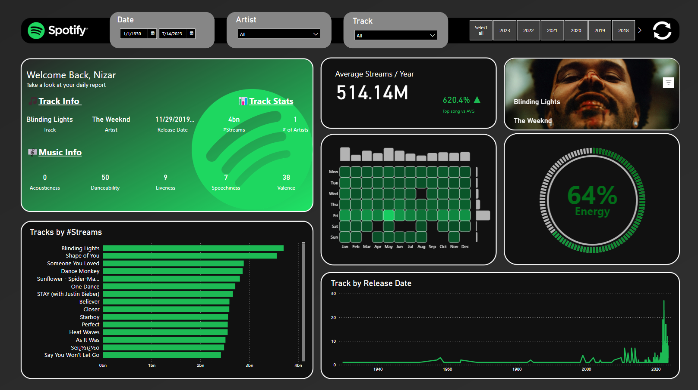
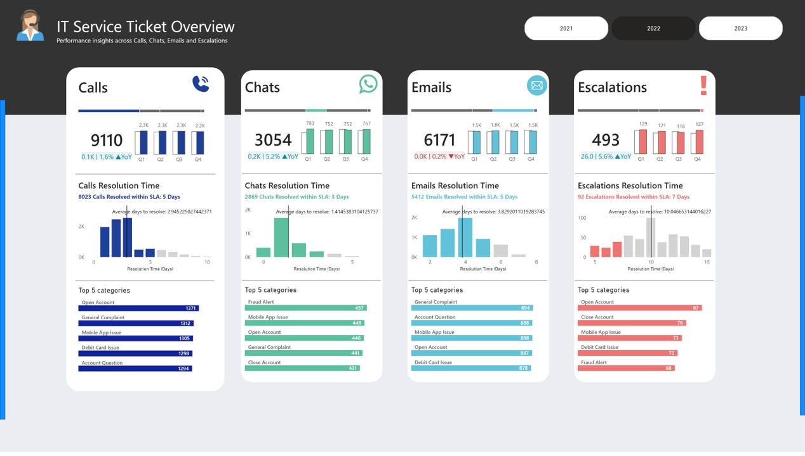
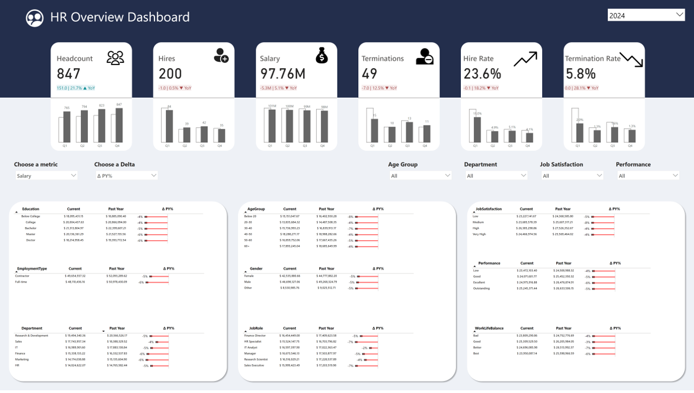
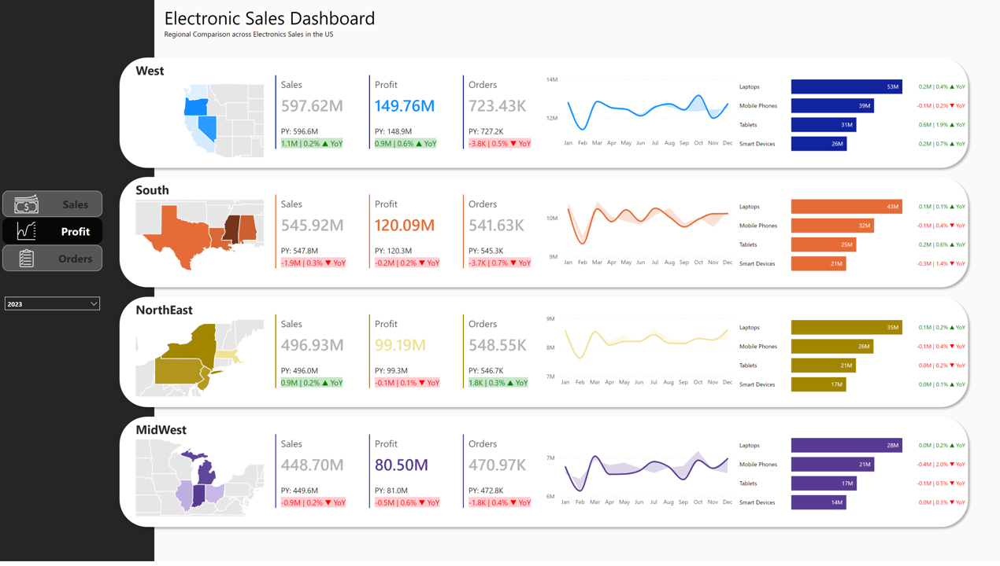
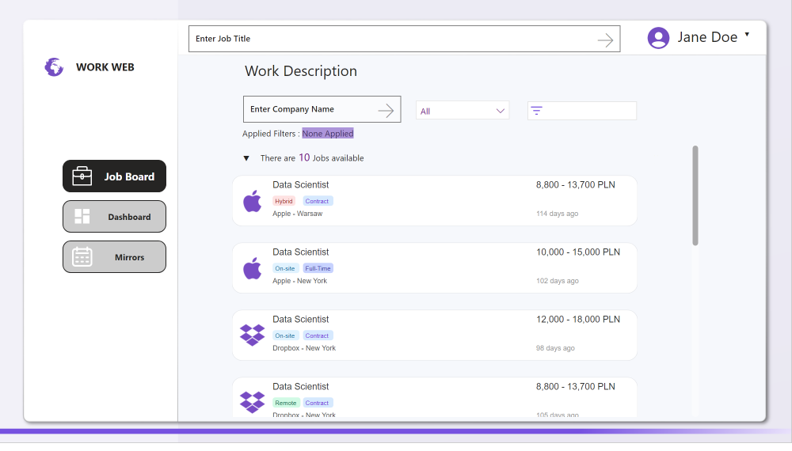
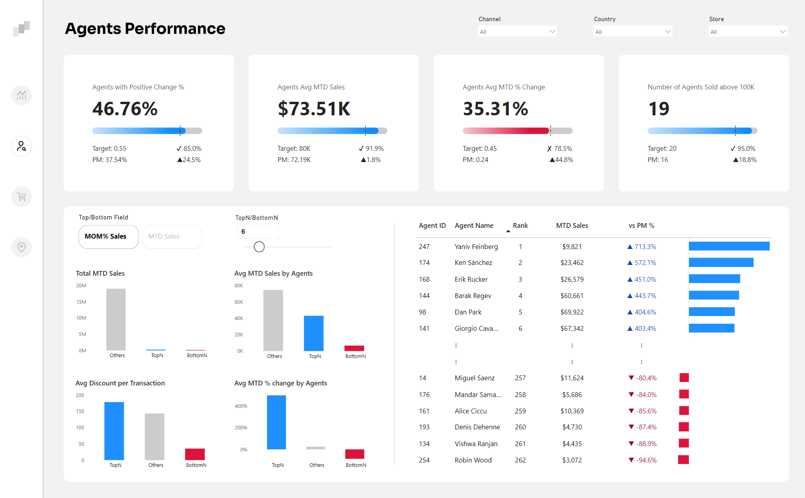
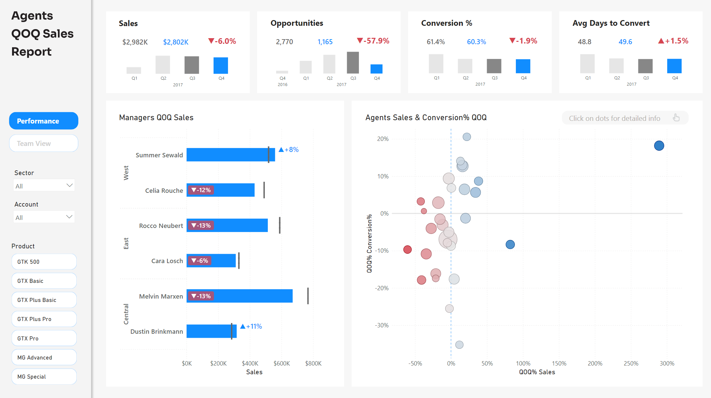

# **Power BI Portfolio by Nizar Mouchtari**

Welcome to my Data Analysis Portfolio! This repository showcases my skills and experience in the field of data analysis. 

- I’ve spent 2+ years in data analytics, focusing on **Power BI**, **DAX**, and **Power Query**.  
- Turning raw numbers into clear insights helping organizations to make an impactful decision-making .  
- I’m big on storytelling and making sure decisions have a solid data-driven foundation.

My expertise includes:

- **Microsoft Power BI**: Designing interactive dashboards end-to-end.  
- **SQL & Python**: Data integration, automation, and predictive modeling.  

---

## **📊 Power BI Projects**

Below is a selection of Power BI dashboards I have developed. Each project demonstrates advanced BI techniques, such as interactive visualizations, advanced DAX measures.

---

### **1. Spotify Trends Dashboard**
- **Description**: This dashboard visualizes key trends and user behaviors on Spotify. It provides insights into user preferences by region, time, and music genre. The project helps identify peak listening times and top genres.
- **Key Features**:
  - Detailed analysis of streaming activity across various regions.
  - Genre trends and time-of-day user engagement metrics.
  - Marketing insights for promotional strategies.
- **Link to the**  [demo](https://app.powerbi.com/view?r=eyJrIjoiYTA1YzQ5MzYtNWEyOC00YTc0LTk2MDYtODQyNWU3Zjk4ZmI2IiwidCI6ImZkOWMxOGU5LTljZTktNDhjZC05NDQyLTc0YTkyZjg2NTlmNyJ9)

---

### **2. IT Service Performance Dashboard**
- **Description**: Analyzes IT service ticket performance by monitoring resolution times, ticket trends, and key performance metrics. This dashboard enhances IT operations by identifying bottlenecks and tracking service efficiency.
- **Key Features**:
  - Breakdown of open vs. resolved tickets over time.
  - Performance insights into ticket resolution and escalation.
  - Highlights trends in service categories for improvement.
- **Link to the**  [demo](https://app.powerbi.com/view?r=eyJrIjoiY2JjNDRlNGItMWZlNS00NjJiLTljODktMWE5YTg1NDBkYTExIiwidCI6ImZkOWMxOGU5LTljZTktNDhjZC05NDQyLTc0YTkyZjg2NTlmNyJ9)

---

### **3. HR Metrics Overview**
- **Description**: This dashboard provides actionable insights into HR data, including employee turnover rates, diversity metrics, and training performance. It supports strategic decision-making for HR teams.
- **Key Features**:
  - Interactive visuals for employee lifecycle analysis.
  - Monitoring of training and development program outcomes.
  - Turnover trends by department and gender.
- **Link to the**  [demo](https://app.powerbi.com/view?r=eyJrIjoiOGY2YzcyZmQtMGU4YS00ZjllLWJkM2ItYjU4NWE5MzA3Y2MyIiwidCI6ImZkOWMxOGU5LTljZTktNDhjZC05NDQyLTc0YTkyZjg2NTlmNyJ9)

---

### **4. Electronics Sales Analysis**
- **Description**: This dashboard visualizes sales performance for an electronics retailer. It provides insights into regional performance, top-selling products, and revenue growth trends.
- **Key Features**:
  - Regional comparison of sales data.
  - Analysis of product category performance.
  - Year-over-year sales growth tracking.
- **Link to the**  [demo](https://app.powerbi.com/view?r=eyJrIjoiOTU2NzE0NTYtMjFkYy00NDczLWE2NDUtODM5ZmFmZWIwYTRhIiwidCI6ImZkOWMxOGU5LTljZTktNDhjZC05NDQyLTc0YTkyZjg2NTlmNyJ9)

---

### **5. Work Web Dashboard**
- **Description**: A workplace visualization dashboard designed to showcase a recrutement website app to track jobs on a  power bi. 
- **Key Features**:
  - Real-time job description
  - Ability to search by jobs and company name .
  - Dashboard navigation optimized for user experience.
- **Link to the**  [demo](https://app.powerbi.com/view?r=eyJrIjoiZGNjMTY1MGYtYjIwYy00MjE1LWJmZjMtNTE0MDQzODhlMDc2IiwidCI6ImZkOWMxOGU5LTljZTktNDhjZC05NDQyLTc0YTkyZjg2NTlmNyJ9)

  

---

### **6. Agent Performance Dashboard**
- **Description**: An interactive Power BI dashboard designed to analyze the performance of sales agents and track key indicators related to sales and performance variations.
- **Key Features**:
  - Monthly sales tracking (MTD Sales) and comparison with targets.
  - Ranking of agents based on their performance.
  - Analysis of sales variations in percentage compared to previous periods.
  - Data segmentation by channel, country, and store for in-depth analysis.
- **Link to the**  [demo](https://app.powerbi.com/view?r=eyJrIjoiNWU4MDI2ZTYtZmZiZS00YjRhLTk1ZWItYTUyMTc1NDg1MzZjIiwidCI6ImZkOWMxOGU5LTljZTktNDhjZC05NDQyLTc0YTkyZjg2NTlmNyJ9)

---

### **7. Sales Teams Performance Dashboard**
- **Description**: An interactive Power BI dashboard designed to analyze the performance of sales teams. It provides detailed tracking of sales, opportunities, and conversion rates.
- **Key Features**:
  - sales tracking and comparison with past performance.
  - Analysis of business opportunities and conversion rates.
  - Ranking of managers and agents based on their performance.
  - Visualization of conversion trends and data segmentation by sector, account, and product.
- **Link to the**  [demo](https://app.powerbi.com/view?r=eyJrIjoiNTY1ODY2N2MtZTBhYy00OGQwLWFiMzMtYTVjYjM4OGRhNDFjIiwidCI6ImZkOWMxOGU5LTljZTktNDhjZC05NDQyLTc0YTkyZjg2NTlmNyJ9)

---

## **📜 Certifications**

Below is a list of my professional certifications that showcase my expertise in data analytics and Power BI:

| **Certification**                                 | **Authority**        | **Date Issued** |
|---------------------------------------------------|----------------------|-----------------|
| [Microsoft Certified: Power BI Data Analyst Associate](https://learn.microsoft.com/api/credentials/share/en-us/nizar-mouchtari/59AD15EC9299E2B2) | Microsoft            | June 2024       |
| [Microsoft Certified: Azure Data Scientist Associate](https://learn.microsoft.com/en-us/users/nizar-mouchtari/credentials/57df0812dbb81991) | Microsoft             | June 2024       |
| [Microsoft Certified: Azure AI Fundamentals](https://learn.microsoft.com/en-us/users/nizar-mouchtari/credentials/a55fd5167bb3ebb6) | Microsoft  | June 2024       |
| [Microsoft Certified: Fabric Analytics Engineer Associate](https://learn.microsoft.com/en-us/users/nizar-mouchtari/credentials/fa3adc3d1c72ff7) | Microsoft | June 2024       |
| [Certified Six Sigma Green Belt](https://www.linkedin.com/learning/certificates/six-sigma-green-belt) | LinkedIn             | June 2024       |

---

## **🌟 Key Achievements**

- **EXD SVP Award (Caterpillar Inc., June 2024)**: Recognized for leading a "Big Data for Safety" project to digitize safety and security tools at a Caterpillar France facility, leveraging Power BI for real-time insights.
- Successfully implemented **OEE Dashboards** for critical factory equipment, enabling productivity monitoring and downtime reduction.

---

## **🔗 Contact Me**

Let’s connect! Feel free to reach out to discuss data analytics, BI solutions, or potential collaborations:

**LinkedIn**: [linkedin.com/in/nizar-mouchtari](https://linkedin.com/in/nizar-mouchtari)

